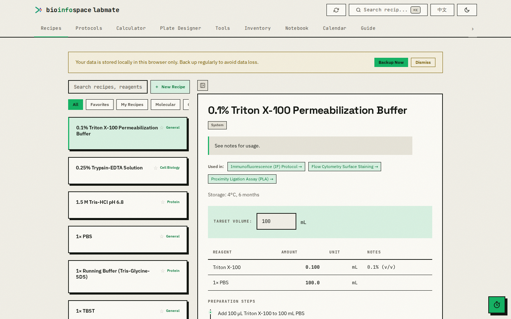
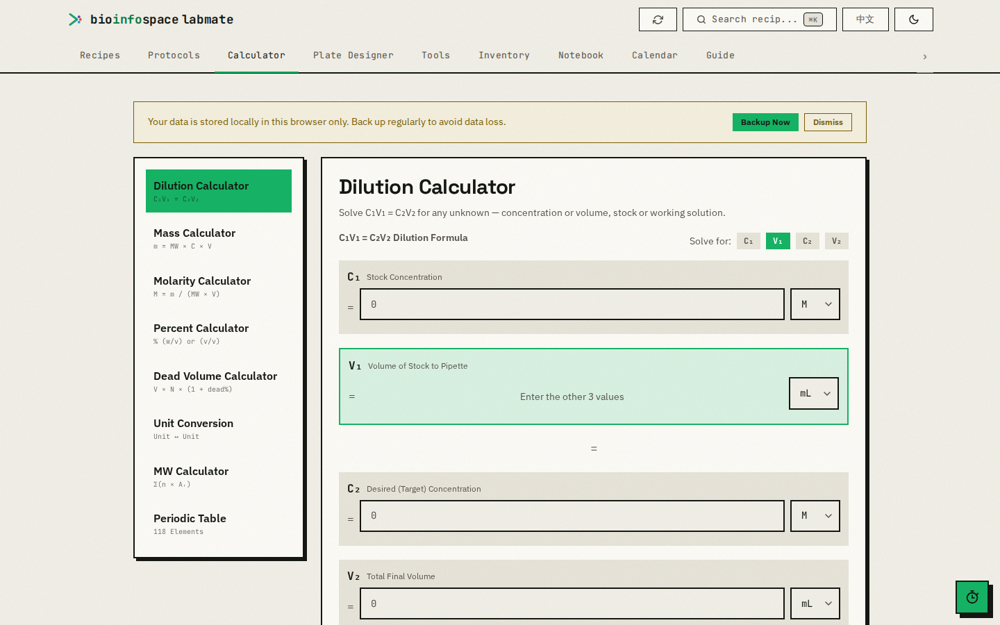
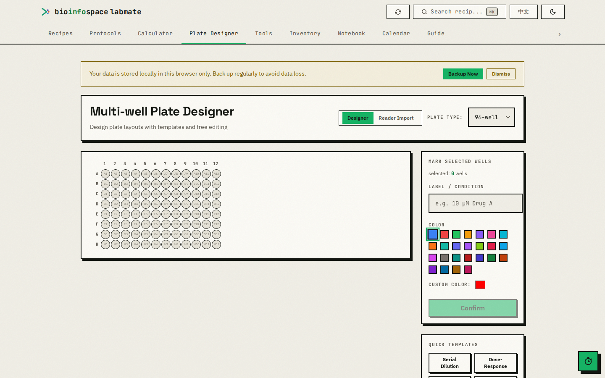
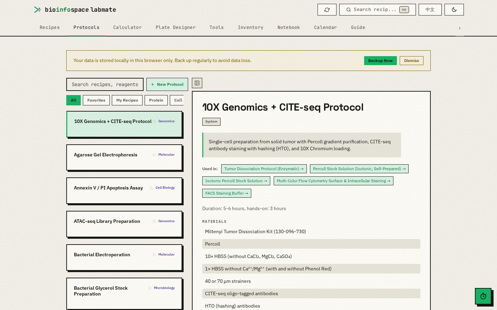
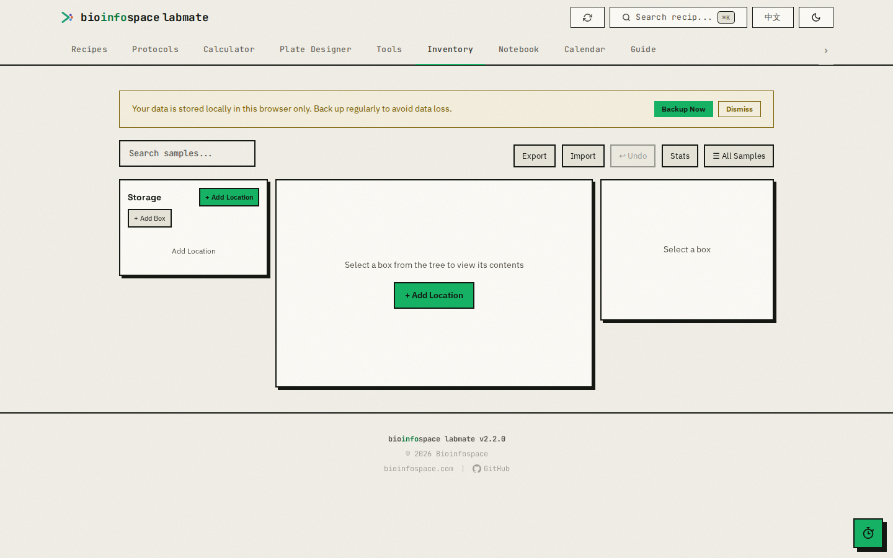
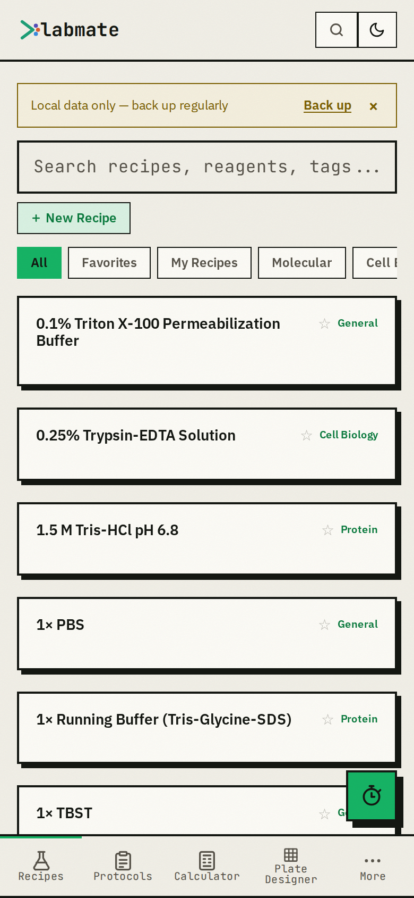

# LabMate

A fast, offline-first lab bench assistant for molecular biology and biochemistry — protocols, buffer & media recipes, calculators, plate design, sample inventory, an experiment notebook, and a calendar, all running client-side in the browser. Part of [Bioinfospace](https://bioinfospace.com).

**Live:** https://apps.bioinfospace.com/labmate/

Everything is stored locally in your browser (IndexedDB) — no account, no server-side database, your data never leaves the device. It installs as a PWA and works fully offline after the first load.



## Features

Organized into tabs, routed under a locale prefix (`/en/…` or `/zh/…`):

| Tab | What it does |
| --- | --- |
| **Recipes** | Curated buffers, media, and staining solutions with per-component amounts, notes, cross-links, and one-click volume scaling. |
| **Protocols** | ~100 step-by-step molecular biology protocols with brief and detailed step views, reagents, and durations. |
| **Calculator** | Dilution (C₁V₁=C₂V₂), mass, molarity, percent (w/v, v/v), dead-volume, unit conversion, molecular weight, and a 118-element periodic table. |
| **Plate Designer** | Design 6–384-well layouts (templates + free editing) **and Reader Import** — auto-detects Tecan / BioTek / SpectraMax CSV/TSV exports and pivots them to tidy long-format data with a heatmap and per-sample stats. |
| **Tools** | A curated directory of external bench calculators (ELISA standard-curve fitting, NEB Tm, and more), filterable by category. |
| **Inventory** | Sample / box / freezer inventory with position tracking and CSV import/export (per-box or full, with a template). |
| **Notebook** | Structured experiment records — import a protocol, log materials, procedure, and results. |
| **Calendar** | Schedule protocol steps and experiments on a timeline. |
| **Guide** | How-to intro, local data backup/import, replay the onboarding tour, and privacy/storage info. |
| **Assistant** | Optional LLM lab assistant (searches protocols, runs calculators, drafts experiment records). Retrieval-only for bio content — never invents protocol steps or amounts. Hidden unless a backend key is configured (see [The Assistant](#the-assistant)). |

Also app-wide: **bilingual** English / 中文 (carried in the URL), **global search** (`⌘/Ctrl-K`), favorites and custom recipes, and an **offline PWA** with installability and a unified local backup/restore of all your data.

## Screenshots

| Calculator | Plate Designer |
| --- | --- |
|  |  |

| Protocols | Inventory |
| --- | --- |
|  |  |

<p align="center"></p>
<p align="center"><em>Installable PWA with a mobile bottom-nav layout.</em></p>

## Tech stack

- **React 19** + **React Router 7**
- **Vite 6** (build tooling, code-split lazy tabs)
- **Tailwind CSS v4** (via `@tailwindcss/vite`, no config file)
- **Dexie 4** over IndexedDB for all client-side persistence
- **Vitest** + Testing Library for unit tests
- No backend required for the core app — it's a static single-page app served under `/labmate/`.

## Getting started

Requires **Node 22** (matches CI and the deploy build).

```bash
npm install
npm run dev        # http://localhost:5173/labmate/   (note the /labmate/ base path)
```

The dev server serves the app under the `/labmate/` base — open `http://localhost:5173/labmate/`, not the bare root.

### Scripts

| Command | Purpose |
| --- | --- |
| `npm run dev` | Start the Vite dev server. |
| `npm run build` | Production build into `dist/` (base `/labmate/`). |
| `npm run build:native` | Production build with a relative base, for the native desktop/mobile shells. |
| `npm run preview` | Serve the production build locally. |
| `npm run lint` | ESLint over `src/`. |
| `npm run test` / `npm run test:run` | Vitest (watch / once). |
| `npm run format` | Prettier-format `src/`. |

No secrets are needed for local development — see [`.env.example`](.env.example). `VITE_BASE` (default `/labmate/`) controls the deployed base path.

## Project structure

```
src/
  App.jsx              # Router, tab ↔ URL mapping, locale prefixing, layout shell
  components/          # Shared UI (Header, BottomNav, RecipeCard/Detail, modals, Toast, Timer…)
  features/            # One folder per tab: buffers, protocols, calc, plate, tools,
                       #   inventory, notebook, calendar, refs, agent
  lib/                 # Data + logic layer (Dexie db, calculators, experiments, backup, agent/)
  data/                # Code-defined app data (gel formulas, references, plate configs, taxonomy)
  i18n/                # English + 中文 translations
  styles/              # global.css (design tokens + component CSS)
recipes.json           # Committed mirror of the recipe content (see Content)
public/sw.js           # Service worker (offline PWA)
```

The root `index.html` is the **retired pre-Vite monolith**, kept intentionally. The real build entry is `index.vite.html` (Vite renames it to `index.html` in `dist/` at build time).

## Content

Recipe and protocol content comes from a separate repo, [`mianaz/labmate-recipes`](https://github.com/mianaz/labmate-recipes), mirrored here into `recipes.json` (the file the app loads). Recipe `id`s are a stable identifier — user favorites, experiments, and progress are keyed by them in IndexedDB, so ids must not be renamed.

## The Assistant

The **Assistant** is capability-gated: its UI (launcher, panel, `⌘/Ctrl-J`) only appears when the backend reports a configured model key — it probes `GET /api/labmate/agent/models` at load and stays hidden otherwise (`VITE_AGENT_ENABLED=1`/`0` forces it). In production the model calls are relayed by the Bioinfospace site backend (an owner-key proxy) — the browser never holds a model key. Bio content is retrieval-only, calculator numbers are computed deterministically, and write actions go through a per-tool permission gate. The core logic in `src/lib/agent/` is provider- and DOM-agnostic and unit-tested with a scripted fake model.

## Deployment

Push to `main` runs the **Deploy** workflow (`.github/workflows/deploy.yml`): it builds with `VITE_BASE=/labmate/` and swaps `dist/` into `/var/www/apps.bioinfospace.com/labmate/`. **CI** (`.github/workflows/ci.yml`) runs lint + build + tests on every push and PR. Vite's content-hashed filenames handle cache invalidation — do not add a `?v=…` query to asset URLs (it breaks ES-module identity for the lazy chunks).

## Desktop & mobile

Native shells wrap this same web app: **Tauri 2** (desktop) and **Capacitor** (iOS/Android), both loading a relative-base build (`npm run build:native`). Mobile/desktop configuration lives in [`capacitor.config.ts`](capacitor.config.ts); native projects are generated in a dev environment and are not committed.

## Design

LabMate implements the shared Bioinfospace **v2 design system — "Lab-Manual Brutalism × Sequence Telemetry"** (signal green `#16B364`, zero border-radius, monospace as structural type). See [`DESIGN.md`](DESIGN.md); the ground truth in code is `src/styles/global.css` and `src/lib/styleConstants.js`.

## License

The LabMate application source code is licensed under the **MIT License** — free to use, copy, modify, and distribute (including commercially) with attribution. See [LICENSE](LICENSE).

Bundled recipe/protocol data (`recipes.json`) comes from the separate [labmate-recipes](https://github.com/mianaz/labmate-recipes) dataset, licensed **[CC BY 4.0](https://creativecommons.org/licenses/by/4.0/)** (attribution). The underlying procedures are adapted and restated from third-party sources (protocols.io, academic journals, manufacturer manuals) and are not claimed as original work — see that repo's LICENSE for provenance.

## Disclaimer

LabMate is an independent community project and is **not affiliated with, endorsed by, or sponsored by** any of the commercial products, reagents, kits, or instruments it references — including but not limited to Thermo Fisher Scientific, Invitrogen / TRIzol, New England Biolabs, Promega, QIAGEN, Cell Signaling Technology, Abcam, ATCC, 10x Genomics, BioLegend, Tecan, BioTek, and Molecular Devices. All product names and trademarks are the property of their respective owners and are used only to identify the reagents or instruments a protocol or tool refers to. Protocols and calculators are provided for reference, "as is" and without warranty — always follow your institution's safety guidance and the manufacturer's current instructions, and validate before laboratory use.
